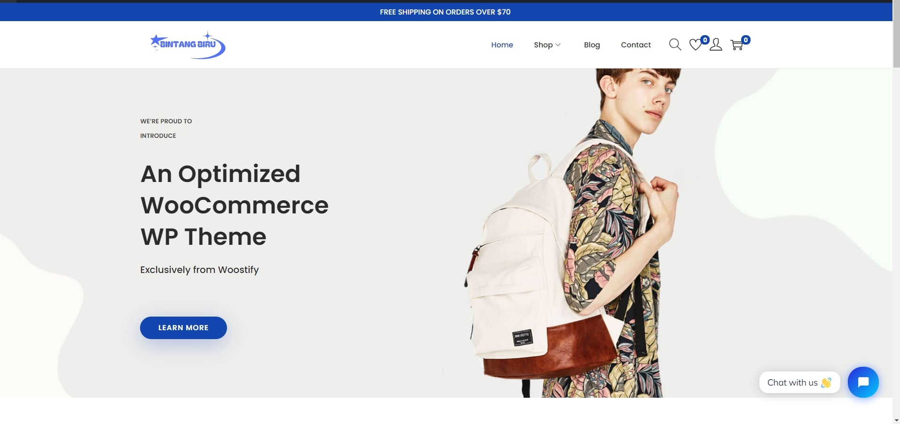

# Informasi Proyek Tugas Akhir E-Commerce

Website ini menggunakan tema dan library dari Woostify.

Website ini mempunyai fitur live chat dari Tidio, dan dapat menangani shipping dan pajak. Pembayaran dapat dilakukan menggunakan PayPal, Midtrans, dan Stripe dalam mode sandbox.

## Plugin yang Digunakan:

- Contact Form 7
- Elementor
- Midtrans WooCommerce Payment Gateway
- WordPress Importer
- Smash Balloon Instagram Feed
- Ti WooCommerce Wishlist
- Tidio Chat
- Variation Swatches for WooCommerce
- WooCommerce
- Woostify Sites Library

## Akun Admin WordPress

- Username: solihatun
- Password: admin

Projek ini dikerjakan guna memenuhi tugas akhir mata kuliah e-commerce yang diampu oleh ibu Asih Winantu S.kom M.Cs secara berkelempok di STMIK El Rahma Yogyakarta, yaitu:

- Hana Solikatun (11220542)
- Naintin Deslia Sari (11220534)
- Resya Aprilia Deanti (11220546)
